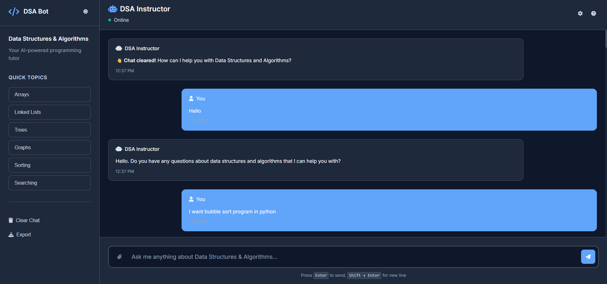
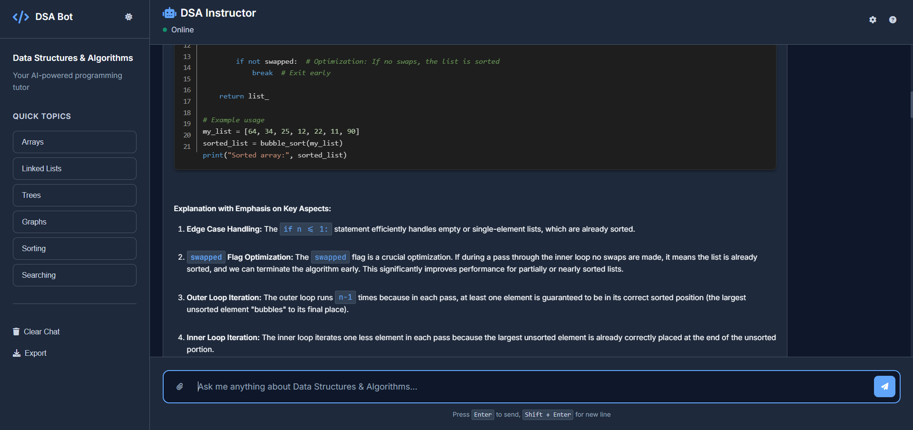

# DSA Instru## 🚀 Features

- **🎨 Modern UI Design**: Professional interface with dark/light theme support
- **💬 Interactive Chat Interface**: Clean, responsive UI for seamless interaction
- **🌙 Dark/Light Mode**: Toggle between themes with smooth transitions
- **📱 Responsive Design**: Works perfectly on desktop and mobile devices
- **⚡ Quick Topic Buttons**: Fast access to common DSA topics
- **📤 Export Functionality**: Save your chat conversations
- **🔤 Code Block Support**: Beautiful VS Code-like code blocks with syntax highlighting
  - 🔢 Line numbers
  - 🎯 Language detection (Python, Java, C++, JavaScript, etc.)
  - 📋 Copy-to-clipboard functionality
  - 🎨 VS Code color scheme
- **✍️ Rich Text Formatting**: Support for **bold**, *italic*, `inline code`, and more
- **🧠 Persistent Context**: Maintains teaching context throughout conversations
- **⌨️ Keyboard Shortcuts**: Enter to send, Shift+Enter for new linesA specialized AI teaching assistant for Data Structures and Algorithms, built with Google's Gemini AI and a modern web interface.

## � Screenshots

### Main Chat Interface


### Code Block Features with Syntax Highlighting


## �🚀 Features

- **Interactive Chat Interface**: Clean, responsive UI for seamless interaction
- **Code Block Support**: Beautiful VS Code-like code blocks with syntax highlighting
  - Line numbers
  - Language detection
  - Copy-to-clipboard functionality
  - Responsive design
- **Persistent System Instructions**: Maintains teaching context throughout conversations
- **Markdown Support**: For rich text formatting in responses

## 🎯 What Makes This Special?

🤖 **AI-Powered Teaching**: Uses Google Gemini AI specifically trained to be a Data Structures and Algorithms instructor
🎨 **VS Code Experience**: Familiar syntax highlighting and code presentation for developers
📚 **Educational Focus**: Designed specifically for learning DSA concepts, not general chat
⚡ **Real-time Code**: Instant syntax highlighting and code formatting as you receive responses
🔧 **Developer-Friendly**: Built by developers, for developers learning DSA

## 🛠️ Tech Stack

- **Frontend**: HTML5, CSS3, JavaScript (ES6+)
- **Backend**: Node.js with Express
- **AI**: Google Gemini API
- **Styling**: Custom CSS with VS Code-inspired theming
- **Icons**: Font Awesome
- **Fonts**: Fira Code (for code) and Inter (for UI)

## 📦 Installation & Setup

### Prerequisites
- Node.js (v14 or higher)
- npm or yarn
- Google Gemini API key ([Get one here](https://makersuite.google.com/app/apikey))

### Quick Start

1. **Clone the repository:**
   ```bash
   git clone https://github.com/ndk123-web/dsa-instructor-bot.git
   cd dsa-instructor-bot
   ```

2. **Install dependencies:**
   ```bash
   npm install
   ```

3. **Environment Setup:**
   Create a `.env` file in the root directory:
   ```env
   GEMINI_API_KEY=your_gemini_api_key_here
   GEMINI_SYSTEM_INSTRUCTION="You are a strict yet highly effective Data Structures Instructor..."
   ```

4. **Start the backend server:**
   ```bash
   node index.js
   ```
   The server will start on `http://localhost:3001`

5. **Open the frontend:**
   - Option 1: Open `client/index.html` directly in your browser
   - Option 2: Use Live Server extension in VS Code
   - Option 3: Use any local server (like `python -m http.server`)

6. **Start chatting!** 🎉

## 🚀 Live Demo

Try asking questions like:
- "Explain binary search algorithm with code"
- "What's the time complexity of merge sort?"
- "Show me how to implement a linked list in Python"
- "Explain BFS vs DFS in graphs"

## 🎮 Usage Guide

### Basic Chat
1. Type your DSA-related questions in the chat input
2. Press **Enter** to send (or **Shift+Enter** for new lines)
3. Get instant, detailed explanations with code examples

### Code Features
Use triple backticks for code blocks in your questions:
````markdown
```python
def binary_search(arr, target):
    # Your code here
    pass
```
````

### Quick Actions
- 🔄 **Quick Topics**: Click sidebar buttons for instant topic questions
- 📋 **Copy Code**: Click the copy button on any code block
- 🌙 **Theme Toggle**: Switch between light and dark modes
- 🗑️ **Clear Chat**: Start fresh conversations
- 📤 **Export**: Save your learning session

### Keyboard Shortcuts
- `Enter`: Send message
- `Shift + Enter`: New line
- Click theme toggle for dark/light mode

## 🎨 Customization

### System Instruction
Modify the system instruction in `index.js` to change the bot's behavior:

```javascript
const systemInstruction = `You are a strict yet highly effective Data Structures Instructor. 
You explain concepts from the ground up, starting with basic intuition and then gradually 
moving into technical depth...`;
```

### Styling
Customize the appearance by editing `client/styles.css`. The color scheme is based on VS Code's dark theme.

## 🤖 Usage

1. Type your DSA-related questions in the chat input
2. Use triple backticks for code blocks:
   ````
   ```javascript
   function example() {
       console.log("Hello, World!");
   }
   ```
   ````
3. Click the copy button to copy code snippets
4. Type "exit" to end the session

## 📝 Code Block Features

- **Syntax Highlighting**: Automatic language detection
- **Line Numbers**: For easy reference
- **Copy Button**: One-click code copying
- **Responsive**: Works on all screen sizes
- **VS Code Theme**: Familiar color scheme for developers

## 📁 Project Structure

```
dsa-instructor-bot/
├── 📁 client/                 # Frontend files
│   ├── 📄 index.html         # Main HTML file
│   ├── 🎨 styles.css         # CSS with dark/light themes
│   └── ⚡ script.js          # JavaScript logic
├── 📁 public/                # Static assets
│   ├── 🖼️ Image1.png         # App screenshots
│   └── 🖼️ Image2.png
├── ⚙️ index.js              # Backend server
├── 📦 package.json          # Dependencies
├── 🔐 .env                  # Environment variables
└── 📖 README.md             # This file
```

## 🌐 API Endpoints

- `POST /api/chat`: Main chat endpoint
  - Request body: `{ "message": "your question" }`
  - Response: `{ "response": "AI response" }`

## 🔧 Troubleshooting

- **CORS Issues**: Ensure your frontend is being served from a web server (not `file://`)
- **API Key Errors**: Verify your `.env` file has the correct API key
- **Code Formatting**: Make sure to properly format code blocks with triple backticks

## 🤝 Contributing

Contributions are welcome! Please feel free to submit a Pull Request. For major changes, please open an issue first to discuss what you would like to change.

## � Found a Bug?

If you find a bug or have a feature request, please create an issue on GitHub with:
- Clear description of the problem
- Steps to reproduce
- Expected vs actual behavior
- Screenshots if applicable

## �📄 License

This project is licensed under the MIT License - see the [LICENSE](LICENSE) file for details.

## 🙏 Acknowledgments

- 🤖 [Google Gemini AI](https://ai.google.dev/) for the powerful AI capabilities
- 🎨 [VS Code](https://code.visualstudio.com/) for the color scheme inspiration
- 🌈 [Prism.js](https://prismjs.com/) for syntax highlighting
- 💾 [Font Awesome](https://fontawesome.com/) for beautiful icons
- 🔤 [JetBrains Mono](https://www.jetbrains.com/mono/) for the code font

## 📞 Connect

- 🔗 **GitHub**: [ndk123-web](https://github.com/ndk123-web)
- 🌐 **Repository**: [dsa-instructor-bot](https://github.com/ndk123-web/dsa-instructor-bot)

---

**Made with ❤️ for the programming community**

*Happy Learning! 🚀*